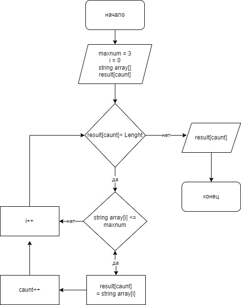

## решение задачи

## 1)
* необходимо завести максмальное допкстимое число знаков в слове - это maxnum = 3 
* заводим i - это значения массива которые ввел пользователь
* string array[] - массив в виде строки заполенненый значениями i
* result[caunt] пустой массив в который мы в последствии бкдем помещать родходящие значения под условия

## 2) 
* проходим по всему массиву 
* значения массива которые не соответствуют услови <=maxnum мы пропускаем, а которые соответствуют помещаем в номый пустой масиив result[caunt]

## 3) 
* Расспечатаваем новый заполненный масиив result[caunt]